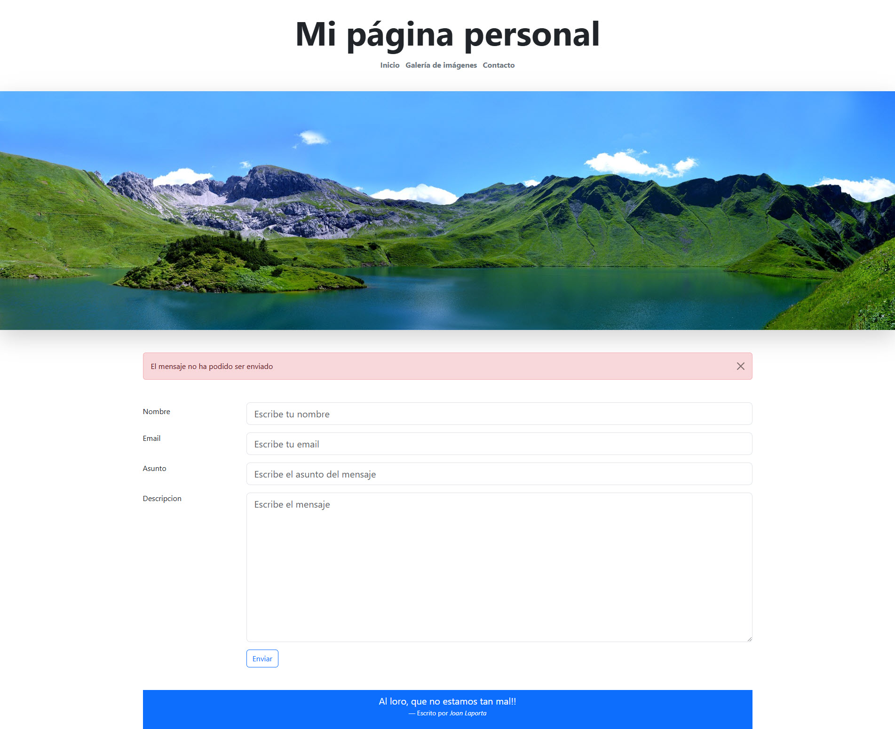
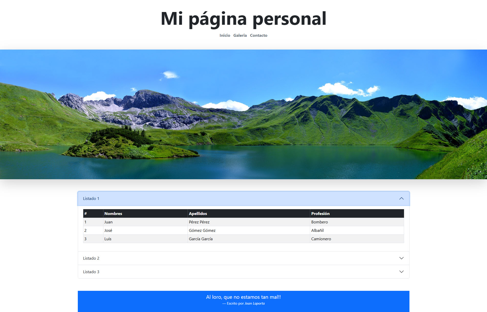

# Aplicaciones Web
Asignatura Aplicaciones Web de 2º curso del ciclo de grado medio Sistemas Microinformáticos y Redes

## Bootstrap

### Prácticas

- [X] Práctica 1: Introducción a Bootstrap. Clase Container
- [X] Práctica 2: Grids
- [X] Práctica 3: Introducción al formateo de textos
- [ ] Práctica 4: Listas
- [X] Práctica 5: Imágenes
- [ ] Práctica 6: Tablas
- [X] Práctica 7: Formularios
- [ ] Práctica 8: Listas desplegables
- [ ] Práctica 9: Input group
- [X] Práctica 10: Alertas
- [ ] Práctica 11: Botones
- [ ] Práctica 12: Cards
- [ ] Práctica 13: Listado de grupos
- [ ] Práctica 14: Carrusel
- [ ] Práctica 15: Collapse
- [ ] Práctica 16: Menús
- [ ] Práctica 17: Acordeones

### Apuntes

- [Márgenes y espaciado](MARGENES.md)
- [Tamaño del texto](TEXTO.md)
- [Color del texto](TEXTO2.md)
- [Color del fondo](COLOR_DE_FONDO.md)

### Enlaces

- https://picsum.photos/

### Entregas

Al final de este bloque deberemos entregar una página web personal con 4 páginas:

- [X] Página principal
  - Esta página utilizará un grid para crear su estructura básica: una cabecera, un cuerpo y un pie.
  - En la cabecera incluiremos el título de la página, una imagen y un menú de navegación. La imagen se debe adaptar al ancho de nuestra pantalla.
  - El cuerpo, a su vez, contendrá una sección lateral y una sección principal. La sección principal contendrá varias columnas que se ajustarán en función del tamaño de la pantalla.	  
  - En el pie de página incluiremos dos columnas. En la primera, pondremos nuestros datos de contacto (nombre y correo electrónico). En la segunda, adjuntaremos una cita. La disposición de ambas se ajustará al ancho de la pantalla.
  - Fecha de entrega **2/2/2025**
  
  
  
- [X] Formulario de contacto
  - Esta página mostrará un formulario que nos permitirá enviar un correo electrónico. Este formlularo tendrá campos para el nombre, el correo electrónico, el asunto y el cuerpo del mensaje.
  - Este formulario se mostrará en dos columnas para un tamaño de pantalla grande y en una para un tamaño de pantalla pequeño.
  - Este formulario incluirá un botón. Al clicar sobre él, se mostrará una alerta indicando que el mensaje no se ha podido enviar.
  - Esta alerta contendrá un botón que nos permitirá cerrarla.
  - Fecha de entrega **(por concretar)**
	
  
  
- [ ] Galería de imágenes
  - Esta página mostrará una serie de imágenes (al menos 6) mediante un Carousel.
  - El Carousel incluirá botones para navegar por las imágenes y un texto descriptivo de cada una que aparecera encima.
  - Arriba del Carousel aparecerá una vista en miniatura de todas las imágenes, en columnas de 3 para pantallas grandes y en columnas de 1 para dispositivos pequeños.
  - Fecha de entrega **(por concretar)**
  
  
	 
- [ ] Página de listados
  - Está página mostrará un acordeón con 3 elementos.
  - Dentro de cada elemento del acordeón habrá una tabla.
  - Fecha de entrega **(por concretar)**
  
    
  
**ENTREGA FINAL (fecha por concretar)**
